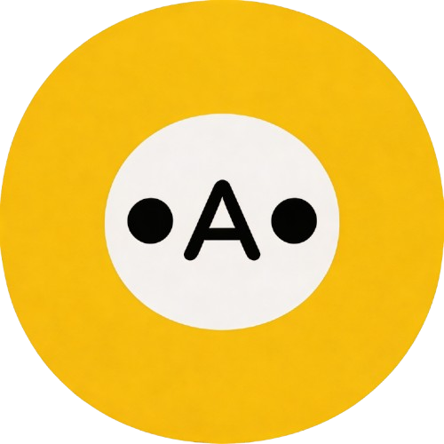

<p align="center">
  
</p>

# OAO — Open Agent Orchestra

Autonomous AI workflow engine powered by the **GitHub Copilot SDK**.

Agents are defined as Git-hosted markdown files with skills. The platform clones agent repos, reads their instructions, creates Copilot sessions with custom tools, and executes multi-step workflows autonomously.

**Documentation:** [https://thfai2000.github.io/open-agent-orchestra/](https://thfai2000.github.io/open-agent-orchestra/)

## Features

- **Agent Management** — Define agents as Git repos with markdown instructions and skills
- **Workflow Engine** — Multi-step workflows with sequential Copilot sessions
- **9 Built-in Tools** — Self-scheduling, webhook management, decision audit, pgvector memory, HTTP requests with Jinja2
- **MCP Server Integration** — Install and configure any MCP server per-agent for domain-specific tools
- **Trigger System** — Cron schedules, webhooks (HMAC-SHA256), events, manual triggers
- **Memory System** — Long-term agent memory with pgvector semantic search
- **Secure Credentials** — AES-256-GCM encrypted storage, Jinja2 template injection (zero agent exposure)
- **Quota Management** — Daily token usage tracking and limits
- **Real-time Updates** — SSE event streaming for live execution monitoring

## Architecture

```
┌─────────────┐     ┌─────────────┐     ┌─────────────────┐
│   OAO-UI    │────▶│   OAO-API   │────▶│  GitHub Copilot │
│  (Nuxt 3)   │     │  (Hono v4)  │     │     SDK         │
│  port 3002  │     │  port 4002  │     └─────────────────┘
└─────────────┘     │             │
                    │  ┌────────┐ │     ┌─────────────────┐
                    │  │BullMQ  │─┤     │  MCP Servers    │
                    │  │Workers │ │────▶│  (stdio, any)   │
                    │  └────────┘ │     │  user-installed |
                    └──────┬──────┘     └─────────────────┘
                           │
              ┌────────────┼───────────┐
              │            │           │
        ┌────────-─┐ ┌─────────┐ ┌─────────┐
        │PostgreSQL│ │  Redis  │ │Git Repos│
        │+pgvector │ │ (Queue) │ │ (Agent  │
        └────────-─┘ └─────────┘ │  Files) │
                                 └─────────┘
```

### Tool Architecture

- **9 Built-in tools** operate on agent_db (triggers, decisions, memory, HTTP requests)
- **MCP tools** are loaded per-agent from user-configured MCP servers via Model Context Protocol (stdio transport)
- Each agent can have multiple MCP servers configured, loaded on-demand during workflow execution

### MCP Server Management

Users can install any MCP-compliant server per-agent through the API:

```bash
# Add an MCP server to an agent
POST /api/mcp-servers
{
  "agentId": "...",
  "name": "My MCP Server",
  "command": "node",
  "args": ["--import", "tsx", "path/to/mcp-server.ts"],
  "envMapping": { "API_KEY": "API_KEY", "API_URL": "API_URL" },
  "writeTools": ["dangerous_action"],
  "isEnabled": true
}
```

The `envMapping` maps agent credential keys to environment variables passed to the MCP server process.

## Quick Start

### Prerequisites
- Node.js >= 20
- Docker Desktop with Kubernetes enabled
- Helm 3
- PostgreSQL 16 + Redis 7 (or use the Helm infrastructure chart)

### Development

```bash
# Install dependencies
npm install

# Set up environment
cp .env.example .env
# Edit .env with your credentials (GITHUB_TOKEN, DATABASE_URL, etc.)

# Run database migrations
npm run db:push

# Start development servers
npm run dev
# Agent API: http://localhost:4002
# Agent UI:  http://localhost:3002
```

### Kubernetes Deployment

```bash
# Build Docker images
BUILD_TAG=1.16.2 bash build.sh

# Set up Helm values
cp helm/oao-platform/values.yaml.template helm/oao-platform/values.yaml
# Edit values.yaml with your secrets

# Deploy
bash deploy.sh
```

### Superadmin Account

On first deploy, the Helm hook automatically creates a **superadmin** account. By default the password is random. To find the generated password, check the database migration job logs:

```bash
kubectl -n open-agent-orchestra logs job/oao-platform-db-migrate | grep -A 5 "SUPERADMIN"
```

You will see output like:

```
  SUPERADMIN ACCOUNT CREATED
  Email:    admin@oao.local
  Password: <random-password>
  ⚠️  Change this password immediately after first login!
```

**Important:** Log in with these credentials and change the password immediately via **Settings → Change Password** in the UI.

For deterministic local development credentials, deploy with a private Helm override instead of relying on hook logs:

```bash
bash deploy.sh \
  --set-string secrets.SUPERADMIN_PASSWORD='Admin@OAO2026' \
  --set-string secrets.SUPERADMIN_FORCE_PASSWORD_RESET=true
```

The force flag is required to reset an already-created superadmin. You can also keep the same values in an ignored file such as `.oao-local/superadmin-values.yaml` and pass it with `bash deploy.sh -f .oao-local/superadmin-values.yaml`.

## Tech Stack

| Layer | Technology |
|-------|-----------|
| API | Hono v4.6, Node.js 20 |
| Frontend | Nuxt 3, shadcn-vue, TailwindCSS |
| Database | PostgreSQL 16 + pgvector, Drizzle ORM |
| Queue | Redis 7 + BullMQ |
| AI | GitHub Copilot SDK (`@github/copilot-sdk`) |
| MCP | `@modelcontextprotocol/sdk` (client, stdio transport) |
| Auth | JWT (jose, HS256) |
| Encryption | AES-256-GCM |
| Deploy | Docker + Helm + Kubernetes |

## Project Structure

```
packages/
├── shared/       # Auth, utils, middleware, validation
├── oao-api/      # Hono API server (port 4002)
├── oao-ui/       # Nuxt 3 dashboard (port 3002)
└── ui-base/      # Shared Nuxt layer (TailwindCSS, auth)

helm/
└── oao-platform/   # Helm chart
```

## License

MIT