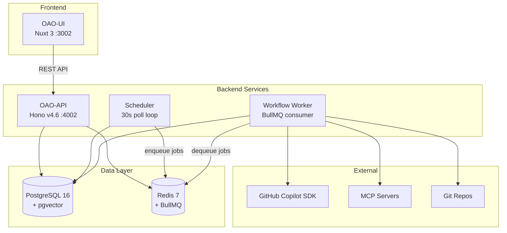
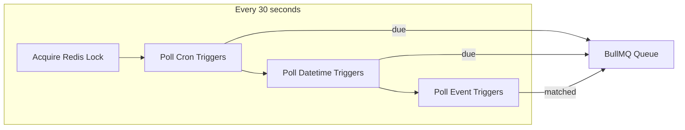
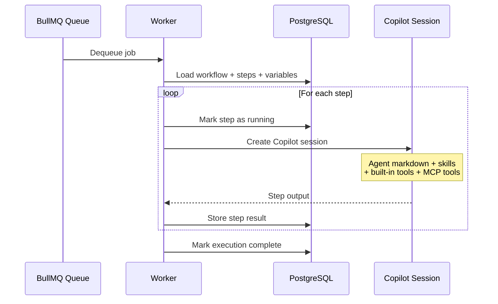
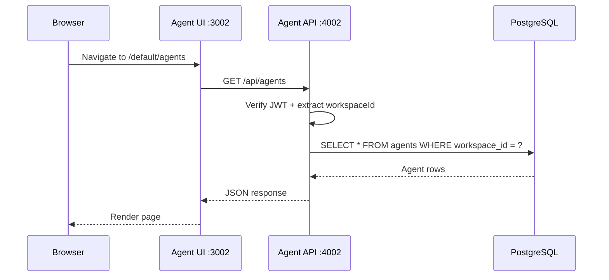

# System Overview

Open Agent Orchestra (OAO) is a monorepo consisting of four packages deployed as Docker containers on Kubernetes.

## High-Level Architecture



## Components

### OAO-API (Hono v4.6, port 4002)

The central REST API handling all CRUD operations:

- **Authentication** — JWT (HS256, 7-day expiry) with workspace context
- **Routes** — Agents, Workflows, Triggers, Executions, Variables, Admin, Events, Webhooks
- **Validation** — Zod schemas on all inputs
- **Security** — AES-256-GCM encryption for credentials, HMAC-SHA256 webhooks

### OAO-UI (Nuxt 3, port 3002)

A single-page application dashboard:

- **Framework** — Vue 3 + Nuxt 3 + shadcn-vue + Tailwind CSS
- **Pages** — ~20 pages for managing agents, workflows, executions, variables, admin
- **Auth** — JWT stored client-side with middleware guards
- **Proxy** — All `/api/*` requests proxied to OAO-API

### Scheduler

A standalone Node.js service that polls for due triggers every 30 seconds:



- **Leader election** — Redis SETNX with TTL prevents duplicate execution
- **Deployment** — Separate K8s Deployment using the same OAO-API Docker image with custom entrypoint

### Workflow Worker

A BullMQ consumer that executes workflow jobs:



- **Concurrency** — 1 job per worker pod (scale by adding pods)
- **Embedded** — Runs within the API server process

## Monorepo Structure

```
packages/
├── shared/       # Auth, encryption, middleware, utilities
├── agent-api/    # Hono REST API + workers + scheduler
├── agent-ui/     # Nuxt 3 dashboard
└── ui-base/      # Shared Nuxt layer (Tailwind, auth composables)

helm/
├── agent-platform/   # API + UI + Scheduler + PostgreSQL + Redis
└── infrastructure/   # Redis + namespace
```

## Request Flow



## URL Routing

All UI routes are workspace-scoped: `/{workspace-slug}/{page}`

| Route | Purpose |
|---|---|
| `/{ws}/login` | Workspace-scoped login |
| `/{ws}/` | Dashboard |
| `/{ws}/agents` | Agent management |
| `/{ws}/workflows` | Workflow management |
| `/{ws}/executions` | Execution history |
| `/{ws}/variables` | Variable management |
| `/{ws}/admin/users` | User administration |
| `/{ws}/workspaces` | Workspace management (super_admin) |
