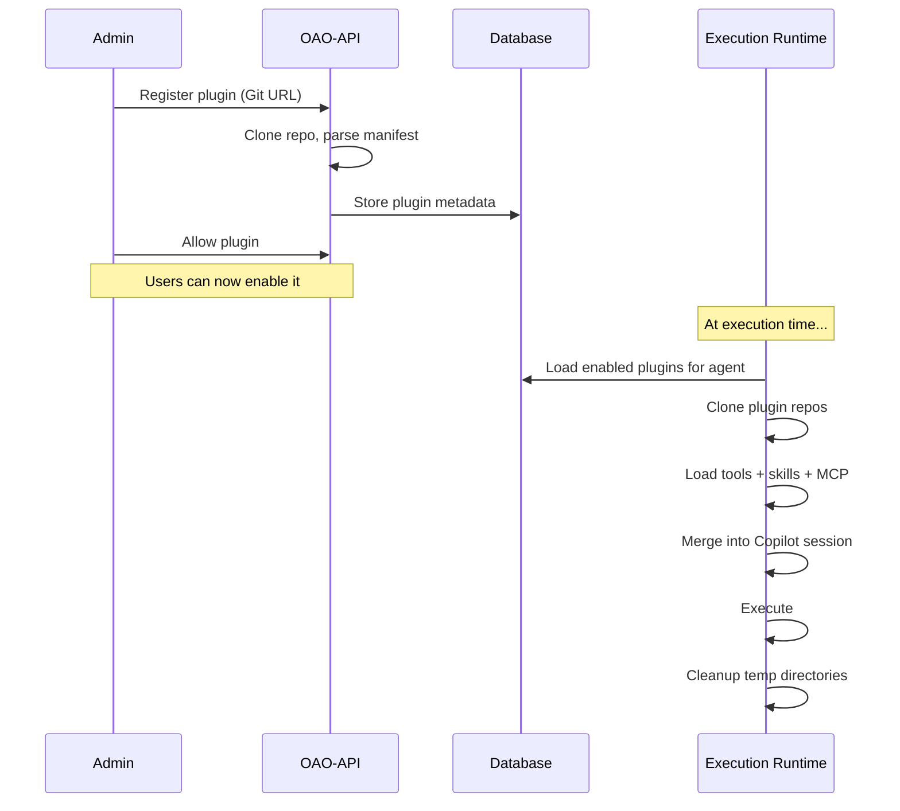

# Plugins

Plugins extend agent capabilities by providing additional tools, skills, and MCP servers — all hosted as Git repositories.

## Plugin Structure

```
my-plugin/
├── plugin.json         # Required — Plugin manifest
├── tools/
│   ├── calculator.js   # Tool scripts
│   └── web-search.js
├── skills/
│   └── domain-knowledge.md
└── mcp-servers/
    └── config.json     # MCP server definitions
```

## Plugin Manifest (`plugin.json`)

```json
{
  "name": "my-plugin",
  "version": "1.0.0",
  "description": "A custom plugin for market analysis",
  "tools": [
    {
      "name": "web_scraper",
      "description": "Scrape a web page and return its content",
      "scriptPath": "tools/web-scraper.ts",
      "parameters": {
        "type": "object",
        "properties": {
          "url": { "type": "string", "description": "URL to scrape" }
        },
        "required": ["url"]
      }
    }
  ],
  "skills": ["skills/domain-knowledge.md"],
  "mcpServers": [
    {
      "name": "playwright-mcp",
      "command": "npx",
      "args": ["@anthropic/mcp-playwright"],
      "envMapping": { "BROWSER_API_KEY": "PLAYWRIGHT_KEY" },
      "writeTools": ["navigate", "click", "fill"]
    }
  ]
}
```

### Manifest Fields

| Field | Type | Required | Description |
|-------|------|----------|-------------|
| `name` | string | Yes | Unique plugin identifier (lowercase, hyphens) |
| `version` | string | Yes | Semver version |
| `description` | string | Yes | Human-readable description |
| `tools` | array | No | Tool definitions with name, scriptPath, parameters |
| `skills` | array | No | Relative paths to skill `.md` files |
| `mcpServers` | array | No | MCP server configurations |

## Lifecycle



## Tool Scripts

Tool scripts are TypeScript/JavaScript files loaded dynamically at runtime:

```typescript
// tools/web-scraper.ts
export const handler = async (params, context) => {
  const { url } = params;
  const response = await fetch(url);
  return { content: await response.text(), status: response.status };
};
```

The platform reads the tool definition from `plugin.json`, imports the script, and wraps it as a Copilot SDK tool.

## Security

- Plugin repos are **cloned into isolated temp directories**, cleaned up after each session
- Only **admin-approved** plugins can be enabled by users
- Tool scripts run **in the Node.js process** — only trusted plugins should be allowed
- Private repos require a GitHub token (encrypted with AES-256-GCM)
- MCP server env vars are resolved from the agent's existing encrypted credentials

## Enabling Plugins

1. **Admin** registers a plugin in **Admin → Plugins** (provide Git repo URL)
2. **Admin** allows the plugin for the workspace
3. **Users** toggle plugins on the Agent detail page → Plugins section
4. At execution time, enabled plugin assets are loaded and merged into the session
