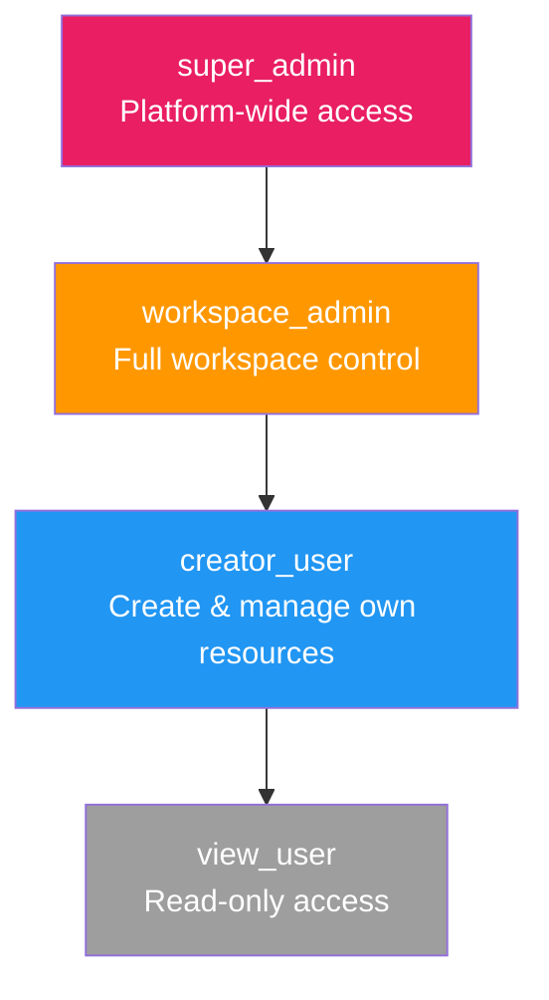

# RBAC

Open Agent Orchestra (OAO) uses role-based access control (RBAC) to manage permissions within each workspace.

## Built-in Roles

## Permission Matrix

| Permission | `super_admin` | `workspace_admin` | `creator_user` | `view_user` |
|---|:---:|:---:|:---:|:---:|
| **Agents** — Create/edit/delete | ✅ All scopes | ✅ All scopes | ✅ Own only | ❌ |
| **Agents** — View | ✅ | ✅ | ✅ | ✅ |
| **Workflows** — Create/edit/delete | ✅ All scopes | ✅ All scopes | ✅ Own only | ❌ |
| **Workflows** — View & run | ✅ | ✅ | ✅ | ✅ |
| **Variables** — User scope | ✅ | ✅ | ✅ Own only | Read own |
| **Variables** — Workspace scope | ✅ | ✅ | Read only | Read only |
| **Variables** — Agent scope | ✅ | ✅ | Own agents | Read only |
| **Admin** — Users & roles | ✅ | ✅ | ❌ | ❌ |
| **Admin** — Models | ✅ | ✅ | ❌ | ❌ |
| **Admin** — Quota settings | ✅ | ✅ | ❌ | ❌ |
| **Admin** — Plugins | ✅ | ✅ | ❌ | ❌ |
| **Admin** — Security | ✅ | ✅ | ❌ | ❌ |
| **Workspaces** — CRUD | ✅ | ❌ | ❌ | ❌ |
| **Workspaces** — Move users | ✅ | ❌ | ❌ | ❌ |

## Role Assignment

- New users register as `creator_user` by default
- `workspace_admin` and `super_admin` can change roles via **Admin → Users**
- `super_admin` role can only be set at the database level (not via UI role selector)

## Workspace-Scoped Resources

When admins create agents or workflows with `scope: workspace`, they become visible to all workspace members:
- Only `workspace_admin` or `super_admin` can create/edit/delete workspace-scoped resources
- `creator_user` and `view_user` can view and use workspace-scoped agents in their workflows
