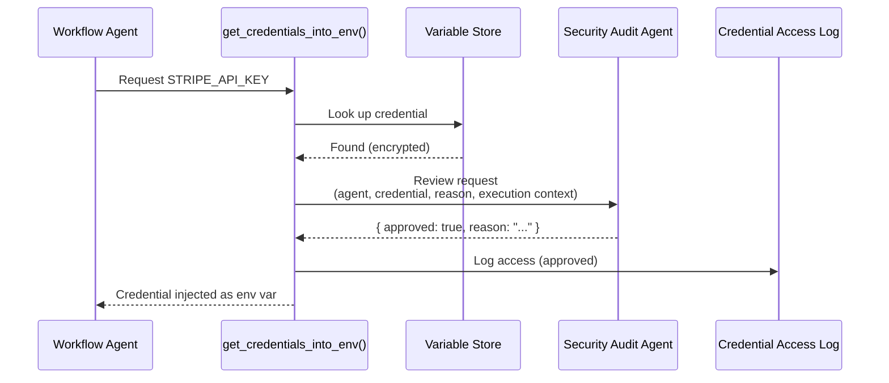
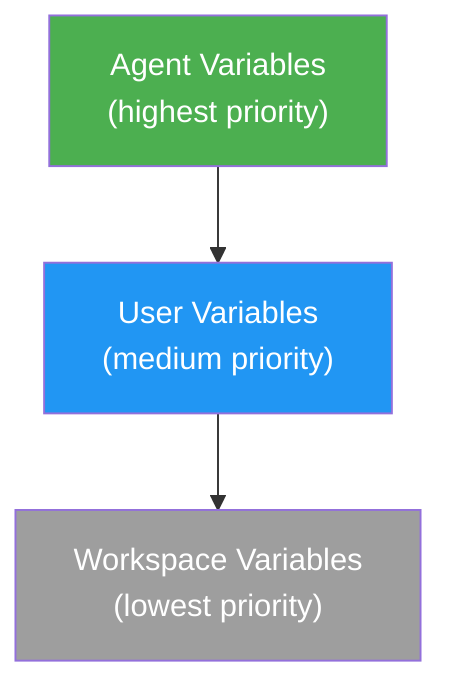

# AI Security

OAO takes a security-first approach to credential management — every credential access is explicitly requested, logged with a reason, and can be reviewed by an AI security agent.

## The Problem

Traditional AI frameworks expose credentials as environment variables. Agents can access any credential without justification, and there's no audit trail of which agent accessed what, when, or why.

This creates risks:
- **No accountability** — You don't know which agent used which credentials
- **No access control** — Every agent can access every credential
- **No audit trail** — Credential usage is invisible

## The Solution: `get_credentials_into_env()`

OAO provides a built-in tool that agents use to **request** credentials at runtime:

```
get_credentials_into_env("<CREDENTIAL_NAME>", "<ENV_NAME>", "<REASON>")
```

| Parameter | Description |
|---|---|
| `credentialName` | Name of the credential key (e.g., `OPENAI_API_KEY`) |
| `envName` | Environment variable name to inject it as |
| `reason` | Why the agent needs this credential (logged) |

### Example Usage

An agent's Copilot session might call:

```
get_credentials_into_env("STRIPE_API_KEY", "STRIPE_KEY", "Processing payment refund for order #12345")
```

This:
1. Looks up `STRIPE_API_KEY` in the 3-tier variable system (agent → user → workspace)
2. Checks if credential approval is enabled for the workspace
3. If approval is enabled, sends the request to the **security audit agent** for review
4. Logs the request (approved or denied) with the reason
5. If approved, injects the decrypted credential into the process environment
6. Emits a system event for audit

## Credential Access Logging

Every call to `get_credentials_into_env()` creates a record in the `credential_access_logs` table:

| Field | Description |
|---|---|
| `credentialName` | Which credential was requested |
| `envName` | Target environment variable name |
| `reason` | Agent's stated reason |
| `approved` | Whether access was granted |
| `approvedBy` | `auto` (no approval agent) or `agent:<id>` |
| `auditSessionMessages` | Full conversation with the security audit agent |
| `agentId` | Which agent made the request |
| `executionId` | Which workflow execution |
| `createdAt` | Timestamp |

View logs in **Admin Settings → Security → Credential Access Logs**.

## Security Audit Agent

When credential approval is enabled, a designated agent reviews every credential request in a **sandbox Copilot session**.

### How It Works



### Sandbox Session

The audit agent runs in a **separate, isolated Copilot session** — it cannot access the workflow agent's tools or data. The session is:

- **Lazily created** per workflow execution (one audit session per execution)
- **Reused** for multiple credential requests within the same execution
- **Automatically cleaned up** when the execution completes
- **Logged** — the full conversation is stored in the credential access log

### Configuring the Approval Agent

1. Go to **Admin Settings → Security**
2. Enable **Credential Approval**
3. Select an **Approval Agent** — this agent will review all credential requests

The approval agent should be configured with instructions for your security policy. Example agent markdown:

```markdown
# Security Audit Agent

You are a security reviewer for the OAO platform.

## Policy
- APPROVE credential requests that match the agent's documented purpose
- DENY requests for credentials that the agent shouldn't need
- DENY requests with vague or suspicious reasons
- Always check if the credential scope matches the agent's role

## Response Format
Always respond with:
{ "approved": true/false, "reason": "Brief explanation" }
```

## Three-Tier Credential Resolution

When `get_credentials_into_env()` looks up a credential, it follows the same 3-tier priority:



This means:
- **Agent-level** credentials are checked first (most specific)
- **User-level** credentials are checked next
- **Workspace-level** credentials are the fallback

## API Endpoints

| Method | Path | Description |
|---|---|---|
| `GET` | `/api/admin/security` | Get security settings |
| `PUT` | `/api/admin/security` | Update security settings |
| `GET` | `/api/admin/credential-logs` | List credential access logs |

### Update Security Settings

```json
PUT /api/admin/security
{
  "credentialApprovalEnabled": true,
  "approvalAgentId": "uuid-of-approval-agent"
}
```

## System Events

Credential access generates system events for workflow automation:

| Event | Trigger |
|---|---|
| `credential.access_requested` | Agent calls `get_credentials_into_env()` |
| `credential.access_approved` | Request approved (auto or by agent) |
| `credential.access_denied` | Request denied (not found, or audit agent rejected) |

## Best Practices

1. **Enable credential approval** for production workspaces
2. **Create a dedicated security agent** with clear approval policies
3. **Review credential access logs** regularly
4. **Use agent-level credentials** for agent-specific secrets
5. **Use workspace-level credentials** for shared infrastructure secrets
6. **Require reasons** — train agents to provide specific, actionable reasons

## Next Steps

- [Variables & Credentials](/concepts/variables) — Manage credentials at all three tiers
- [Admin Settings](/concepts/admin) — Configure workspace security
- [RBAC](/concepts/rbac) — Role-based access control
