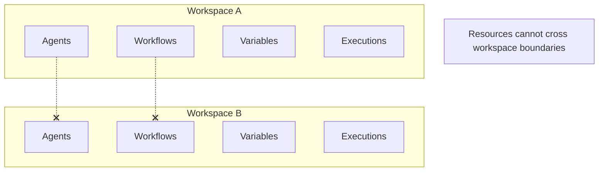

# Workspaces

A **workspace** is a tenant isolation boundary. All resources (agents, workflows, variables, executions, models) are scoped to a workspace.

## How Workspaces Work



- A **Default Workspace** (`slug: default`) is created on first deployment and cannot be deleted
- Each workspace has a unique slug used in URLs
- Resources cannot be accessed across workspace boundaries
- Users belong to exactly one workspace

## URL Pattern

All UI routes are prefixed with the workspace slug:

```
http://localhost:3002/{workspace-slug}/agents
http://localhost:3002/{workspace-slug}/workflows
http://localhost:3002/{workspace-slug}/executions
http://localhost:3002/{workspace-slug}/variables
http://localhost:3002/{workspace-slug}/admin/models
```

The root URL (`/`) redirects to `/{user's workspace slug}` if authenticated, or `/default/login` if not.

## Resource Scoping

Resources within a workspace have two scope levels:

| Scope | Visibility | Who Can Create |
|---|---|---|
| **User** (default) | Only the creator (or admins) | Any user except `view_user` |
| **Workspace** | All workspace members | Admins only |

Scope is set at creation time and **cannot be changed** afterward.

## Workspace Management

Only `super_admin` users can:
- Create new workspaces (`POST /api/workspaces`)
- List all workspaces with member counts
- View workspace details and members
- Move users between workspaces
- Delete non-default workspaces (must have 0 members)
