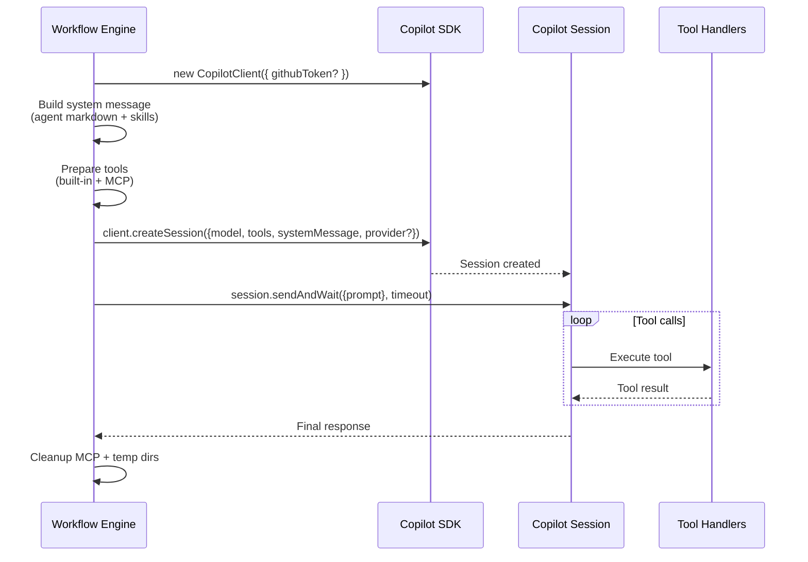
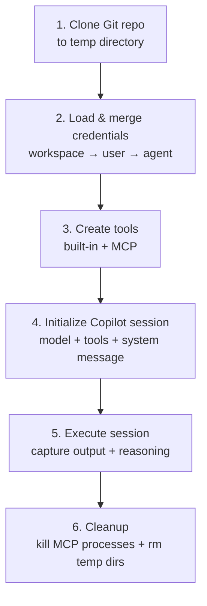
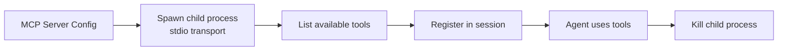

# Copilot Sessions

Each workflow step creates a fresh [GitHub Copilot SDK](https://github.com/features/copilot) session with the agent's personality, skills, and tools.

## Session Lifecycle



## System Message Construction

The system message is assembled from:
1. **Agent markdown** — the main `.md` file (personality, instructions)
2. **Skills** — additional `.md` files appended as `## Agent Skills` section

```typescript
const systemContent = `${agentMarkdown}${skillsContent}`;
// Passed as: systemMessage: { mode: 'customize', content: systemContent }
```

## Session Setup Process



## Tool Types

### Built-in Tools (9)

Platform tools created with `defineTool()` from the Copilot SDK:

| Tool | Parameters | Description |
|---|---|---|
| `schedule_next_workflow_execution` | `delayMinutes`, `userInput` | Schedule next execution |
| `manage_webhook_trigger` | `action`, `path`, etc. | CRUD webhook triggers |
| `record_decision` | `decision`, `reasoning`, `confidence` | Audit trail entries |
| `memory_store` | `content`, `category`, `tags` | Store with vector embeddings |
| `memory_retrieve` | `query`, `limit`, `category` | Semantic search retrieval |
| `edit_workflow` | `stepUpdates[]` | Modify workflow steps |
| `read_variables` | `scope`, `variableType` | Read variables |
| `edit_variables` | `key`, `value`, `scope`, etc. | Create/update variables |
| `simple_http_request` | `method`, `url`, `headers`, etc. | Curl-like HTTP requests with Jinja2 templating |

### MCP Tools

Loaded from configured MCP servers at session start. Every agent receives a default **OAO Platform** MCP server, and custom MCP servers are merged on top of it:



The default OAO Platform MCP server is a bundled stdio server that calls the OAO REST API with a short-lived JWT derived from the current session context:

- Workflow sessions act as the owning agent user.
- Conversation sessions act as the interactive user.
- The server is system-managed per agent and can be disabled, but not deleted.
- Custom MCP servers still use their configured command, args, and credential-to-env mapping.

The agent editor uses the same runtime assumptions when inspecting tools. The grouped tool catalog shows the default OAO Platform server automatically and renders any `mcp.json.template` override before it probes template-defined MCP servers.

Agent tool selection now supports two modes:

- Legacy mode: the saved value is a built-in tool array, so all discovered MCP tools remain enabled.
- Explicit mode: the saved value is a full allowlist, so OAO filters both built-ins and MCP tools before starting the Copilot session.

## Permission Handling

For agent workflows, all tool calls are auto-approved:

```typescript
onPermissionRequest: approveAll
```

Write tools (configured per MCP server via `writeTools`) receive explicit permission through the handler.

## Model Configuration

The model is resolved per step:
1. **Step-level model** (if specified)
2. **Workflow default model** (fallback)
3. **Platform default** (`DEFAULT_AGENT_MODEL` env var, defaults to `gpt-4.1`)

Each workspace model record also controls the session provider mode:

- **GitHub provider** — OAO creates `CopilotClient({ githubToken })` and does not send `SessionConfig.provider`
- **Custom provider** — OAO keeps the Copilot client default and sends `SessionConfig.provider` from the model record (`type`, `baseUrl`, auth mode, wire API, Azure API version)

For custom providers, OAO resolves the auth secret in this order:
1. Agent-level `GitHub Copilot Token / LLM API Key` credential
2. `DEFAULT_LLM_API_KEY`
3. `GITHUB_TOKEN`

## Key Environment Variables

| Variable | Description |
|---|---|
| `GITHUB_TOKEN` | Default GitHub Copilot token, and fallback auth for custom providers when `DEFAULT_LLM_API_KEY` is unset |
| `DEFAULT_LLM_API_KEY` | Optional default API key / bearer token for custom model providers |
| `DEFAULT_AGENT_MODEL` | Default model when none specified (default: `gpt-4.1`) |
| `AGENT_DATABASE_URL` | PostgreSQL connection string |
| `REDIS_URL` | Redis connection string |
| `JWT_SECRET` | Secret for JWT signing/verification |
| `ENCRYPTION_KEY` | 64-char hex string for AES-256-GCM credential encryption |
| `OAO_PLATFORM_API_URL` | Base URL used by the bundled OAO Platform MCP server to call the API |

## Security

- **Webhook HMAC** — SHA-256 signature verification, 5-min replay window, event-id dedup
- **Credentials** — AES-256-GCM encrypted at rest, decrypted only in-memory during execution
- **Agent isolation** — Redis lock ensures one session per agent at a time
- **Git tokens** — Encrypted, used only for repo clone, never logged
- **Input validation** — Zod schemas on all API inputs
- **Session cleanup** — Temp directories destroyed after execution, MCP processes killed
