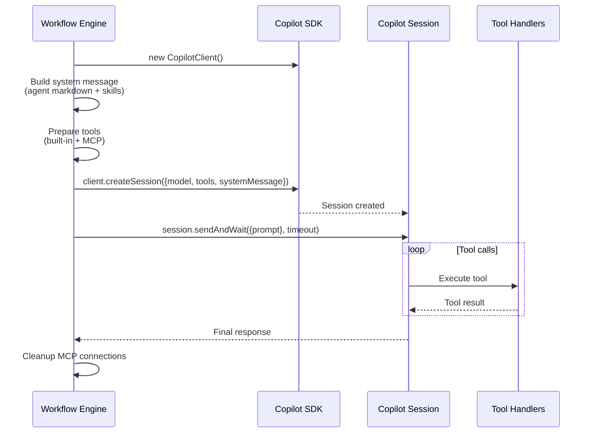
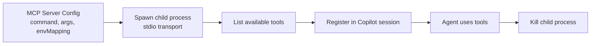

# Copilot Sessions

Each workflow step creates a fresh [GitHub Copilot SDK](https://github.com/features/copilot) session with the agent's personality, skills, and tools.

## Session Lifecycle



## System Message Construction

The system message is assembled from:

1. **Agent markdown** — the main `.md` file (personality, instructions)
2. **Skills** — additional `.md` files appended as `## Agent Skills` section
3. **Plugin skills** — skills from enabled plugins (if any)

```typescript
const systemContent = `${agentMarkdown}${skillsContent}`;
// Passed as: systemMessage: { mode: 'customize', content: systemContent }
```

## Tool Types

### Built-in Tools (8)

Platform tools created with `defineTool()` from the Copilot SDK:

| Tool | Parameters | Description |
|---|---|---|
| `schedule_next_workflow_execution` | `delayMinutes`, `userInput` | Schedule next execution |
| `manage_webhook_trigger` | `action`, `path`, etc. | CRUD webhook triggers |
| `record_decision` | `decision`, `reasoning`, `confidence` | Audit trail entries |
| `memory_store` | `content`, `category`, `tags` | Store with vector embeddings |
| `memory_retrieve` | `query`, `limit`, `category` | Semantic search retrieval |
| `edit_workflow` | `stepUpdates[]` | Modify workflow steps |
| `read_variables` | `scope`, `variableType` | Read variables |
| `edit_variables` | `key`, `value`, `scope`, etc. | Create/update variables |

### MCP Tools

Loaded from configured MCP servers at session start:



### Plugin Tools

Loaded from enabled plugin repositories:
1. Clone plugin Git repos
2. Parse `plugin.json` manifest
3. Load tool scripts from `tools/` directory
4. Register as additional tools in the session

## Permission Handling

For agent workflows, all tool calls are auto-approved:

```typescript
onPermissionRequest: approveAll
```

Write tools (configured per MCP server) receive explicit permission through the `approveAll` handler.

## Model Configuration

The model is resolved per step:
1. **Step-level model** (if specified)
2. **Workflow default model** (fallback)
3. Models are admin-configured and stored in the `models` table

## Session Cleanup

After each step execution:
1. MCP server child processes are killed
2. Plugin temporary directories are removed
3. Agent workspace (cloned repo) is deleted
4. Redis session lock is released
