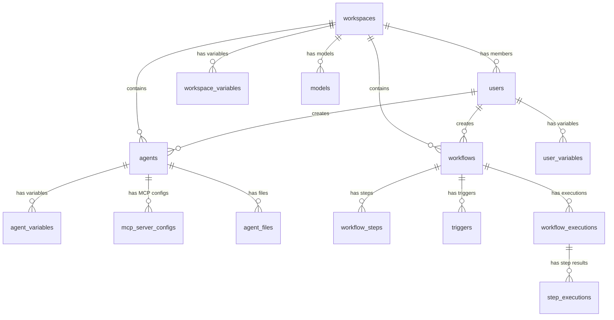

# Database Schema

PostgreSQL 16 with pgvector extension. All tables use UUID primary keys and timestamp with timezone.

## Entity Relationship

## Core Tables

### Tenancy

| Table | Description | Key Fields |
|---|---|---|
| `workspaces` | Tenant boundaries | name, slug, isDefault |
| `users` | Authentication & authorization | email, passwordHash, role, workspaceId |

### Agents

| Table | Description | Key Fields |
|---|---|---|
| `agents` | AI agent configurations | name, sourceType, gitRepoUrl, agentFilePath, status, scope |
| `agent_files` | Database-stored agent files | agentId, filePath, content, fileType |
| `agent_variables` | Agent-scoped variables | agentId, key, valueEncrypted, variableType |
| `mcp_server_configs` | MCP server definitions | agentId, command, args, envMapping, writeTools |

### Workflows

| Table | Description | Key Fields |
|---|---|---|
| `workflows` | Workflow definitions | name, defaultAgentId, defaultModel, isActive, scope |
| `workflow_steps` | Ordered step definitions | workflowId, stepOrder, promptTemplate, agentId, model |
| `triggers` | Execution triggers | workflowId, triggerType, configuration, isActive |

### Execution

| Table | Description | Key Fields |
|---|---|---|
| `workflow_executions` | Execution runs | workflowId, status, triggeredBy, triggerMetadata |
| `step_executions` | Per-step results | executionId, stepOrder, status, output, reasoning |

### Variables

| Table | Description | Scope |
|---|---|---|
| `workspace_variables` | Workspace-level variables | workspaceId |
| `user_variables` | User-level variables | userId |
| `agent_variables` | Agent-level variables | agentId |

All variable tables share: `key`, `valueEncrypted`, `variableType` (credential/property), `injectAsEnvVariable`

### Admin & Quota

| Table | Description |
|---|---|
| `models` | Available AI models per workspace |
| `workspace_quota_settings` | Workspace credit limits |
| `credit_usage` | Credit consumption tracking |
| `plugins` | Plugin registry (Git repos) |

### Audit & Events

| Table | Description |
|---|---|
| `system_events` | Event log (18 event types) |
| `agent_decisions` | Agent decision audit trail |
| `agent_memories` | Long-term memory with pgvector embeddings |
| `webhook_registrations` | HMAC secrets for webhook auth |

## Security Features

- **Encryption**: All credential values encrypted with AES-256-GCM
- **Parameterized queries**: Drizzle ORM prevents SQL injection
- **UUID keys**: Non-guessable primary keys
- **Foreign keys**: Cascade deletes for referential integrity
- **Unique indexes**: Prevent duplicate variable keys per scope
