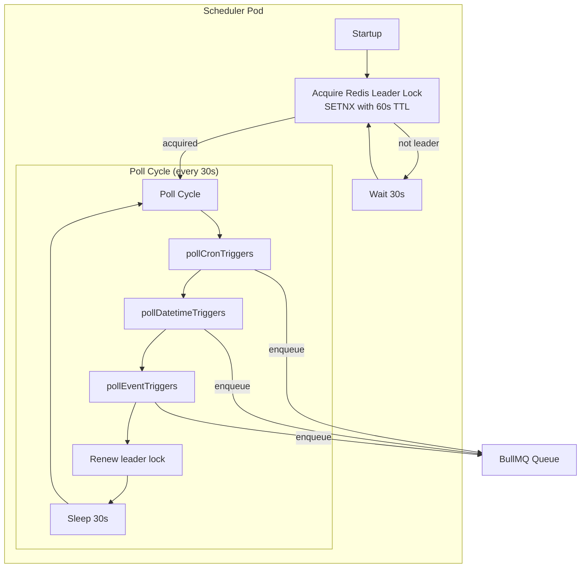
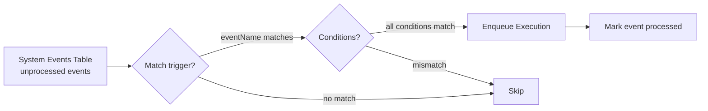
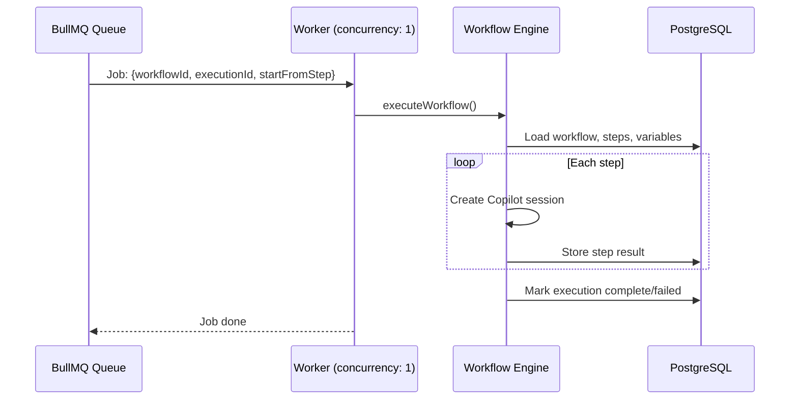

# Scheduler & Workers

The platform uses a dedicated scheduler service and BullMQ workers to process workflow executions.

## Scheduler Service

The scheduler is deployed as a separate Kubernetes deployment that polls for due triggers every 30 seconds.



### Cron Triggers

1. Find active cron triggers where `nextRunAt <= NOW()`
2. Enqueue workflow execution
3. Calculate next run time from cron expression
4. Update `nextRunAt` and `lastFiredAt`

### Datetime Triggers

1. Find active datetime triggers where `configuration.datetime <= NOW()`
2. Enqueue workflow execution
3. **Deactivate the trigger** (one-shot execution)

### Event Triggers



1. Load unprocessed system events
2. For each event, check all active event triggers:
   - Match `eventName` (e.g., `agent.created`)
   - Match `eventScope` (optional filter)
   - Match `conditions` — all key-value pairs must match event data
3. Enqueue matched workflows
4. Mark events as processed

## Workflow Worker (BullMQ)



### Worker Configuration

- **Concurrency**: 1 per pod (prevents resource contention)
- **Connection**: Shared Redis connection for BullMQ
- **Error handling**: Failed jobs mark the execution as failed with error details

### Job Payload

```typescript
interface WorkflowJob {
  workflowId: string;
  executionId: string;
  startFromStep?: number;  // For retries
}
```

## Kubernetes Deployment

```yaml
# Scheduler — single replica
apiVersion: apps/v1
kind: Deployment
metadata:
  name: scheduler
spec:
  replicas: 1
  # ...runs scheduler.ts as entrypoint

# API — includes embedded worker
apiVersion: apps/v1
kind: Deployment
metadata:
  name: agent-api
spec:
  replicas: 1
  # ...runs server.ts which starts both API + BullMQ worker
```

The scheduler runs as a separate deployment while the workflow worker is embedded in the API server process.
