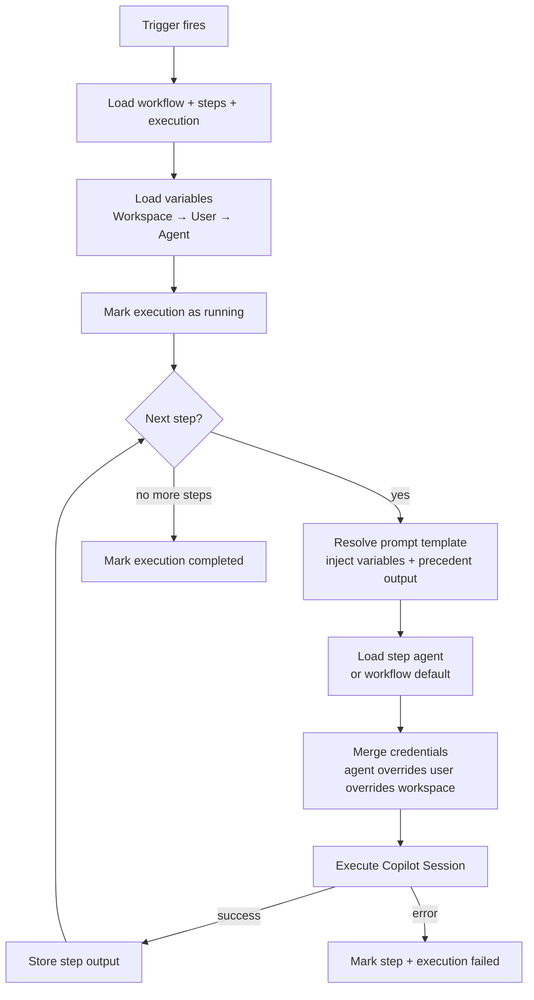
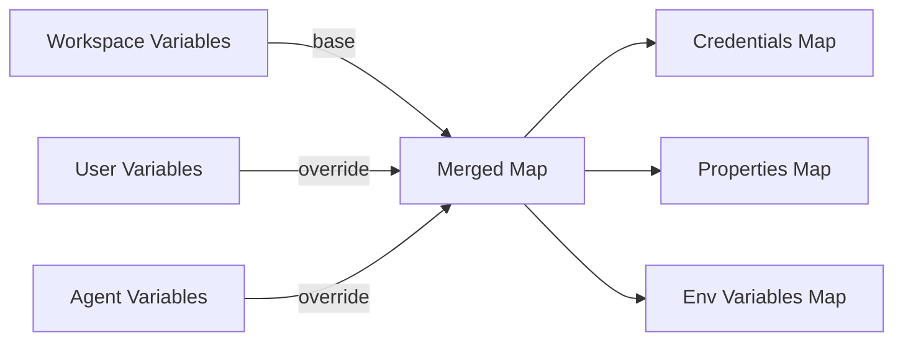
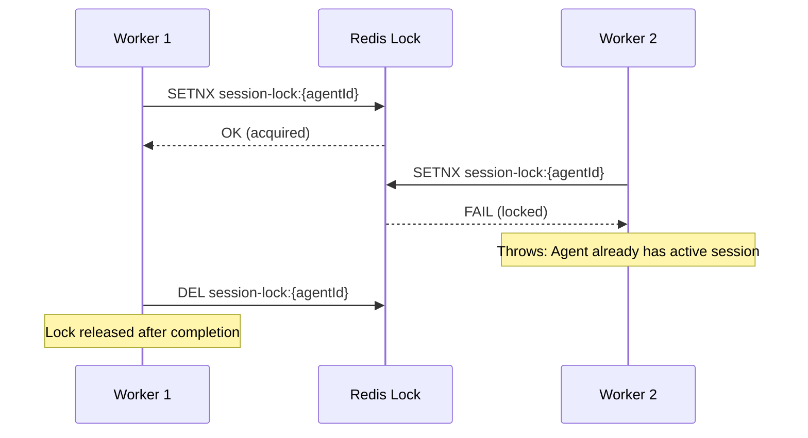
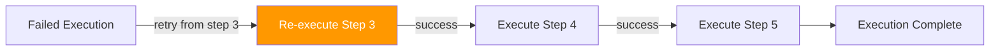

# Workflow Engine

The workflow engine orchestrates the execution of multi-step workflows, managing variable resolution, agent loading, Copilot session creation, and error recovery.

## Execution Pipeline

## Variable Resolution

Variables are resolved in three tiers with override semantics:

For each step, the engine:
1. Starts with **workspace variables** (lowest priority)
2. Overlays **user variables** (same key overrides workspace)
3. Overlays the **step's agent variables** (highest priority)
4. Splits into three maps: credentials, properties, env variables

## GitHub Token Credential Resolution

When an agent references a `githubTokenCredentialId` (pointing to a credential variable), the engine:
1. Looks up the credential by UUID in user variables
2. Falls back to workspace variables if not found
3. Uses the encrypted value for Git authentication (decrypted at clone time)

## Concurrency Control

Each agent can only have one active Copilot session at a time. Concurrent execution is blocked via Redis distributed locks.

## Retry Mechanism

When retrying:
- Steps 1–2 are **preserved** (their outputs remain)
- The precedent output for step 3 is recovered from step 2's stored output
- Execution continues normally from the retry point
