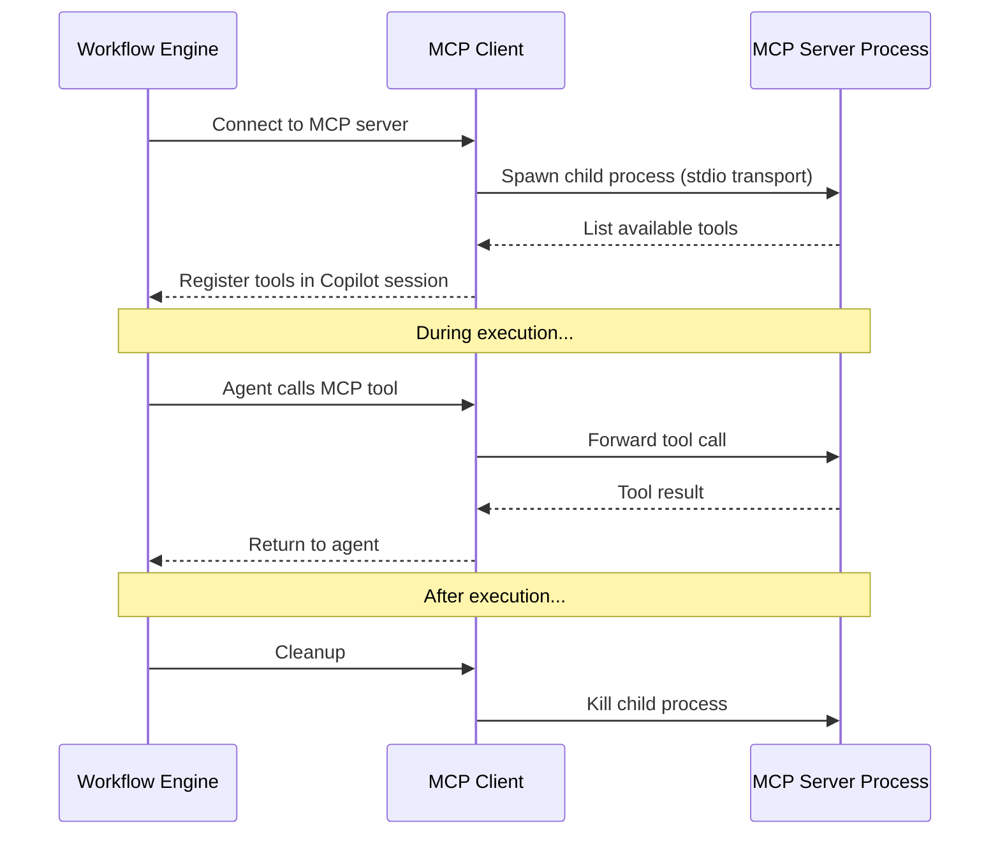

# MCP Servers

[Model Context Protocol (MCP)](https://modelcontextprotocol.io/) servers provide custom tools to agents. Each agent can have multiple MCP server configurations.

## Configuration

Each MCP server is defined with:

| Field | Description | Example |
|---|---|---|
| **Name** | Display name | `Trading Platform` |
| **Command** | Executable to spawn | `node`, `python`, `npx` |
| **Args** | Command arguments | `["server.js", "--port", "3000"]` |
| **Env Mapping** | Map credential variables → env vars | `{"API_KEY": "TRADING_API_KEY"}` |
| **Write Tools** | Tools requiring permission approval | `["execute_trade"]` |

## How It Works



## Environment Variable Mapping

MCP servers often need credentials. Use the env mapping to securely inject them:

```json
{
  "envMapping": {
    "TRADING_API_URL": "TRADING_API_URL",
    "TRADING_API_KEY": "TRADING_API_KEY",
    "TRADER_ID": "TRADER_ID"
  }
}
```

The left side is the environment variable name passed to the MCP server. The right side is the credential variable key resolved from the agent's credential hierarchy.

## Write Tool Permissions

Tools listed in `writeTools` require explicit permission approval before execution. This prevents agents from making destructive calls (e.g., executing trades, deleting data) without authorization.
