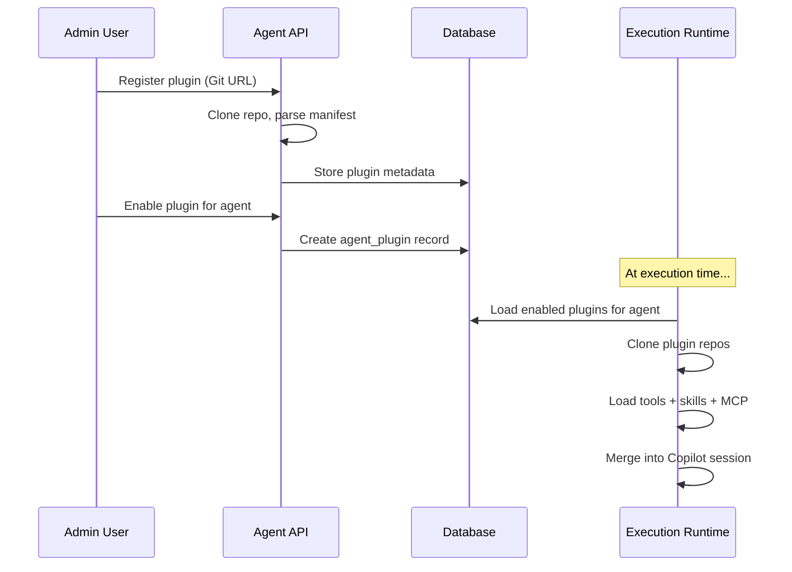

# Plugin System

Plugins extend agent capabilities by providing additional tools, skills, and MCP servers — all hosted as Git repositories.

## Plugin Structure

```
my-plugin/
├── plugin.json         # Manifest file
├── tools/
│   ├── calculator.js   # Tool scripts
│   └── web-search.js
├── skills/
│   └── domain-knowledge.md
└── mcp-servers/
    └── config.json     # MCP server definitions
```

## Plugin Manifest

```json
{
  "name": "my-plugin",
  "version": "1.0.0",
  "description": "A custom plugin for market analysis",
  "tools": ["tools/calculator.js", "tools/web-search.js"],
  "skills": ["skills/domain-knowledge.md"],
  "mcpServers": ["mcp-servers/config.json"]
}
```

## Lifecycle



## Security

- Plugins are cloned into isolated temporary directories
- Only admin-approved plugins can be enabled
- Plugin cleanup runs after every execution
- Tool scripts run in the Node.js process (trusted code only)

## Enabling Plugins

1. **Admin**: Register plugin in Admin → Plugins (provide Git URL)
2. **Users**: Toggle plugins on the Agent detail page
3. At execution time, enabled plugin assets are loaded and merged into the session
