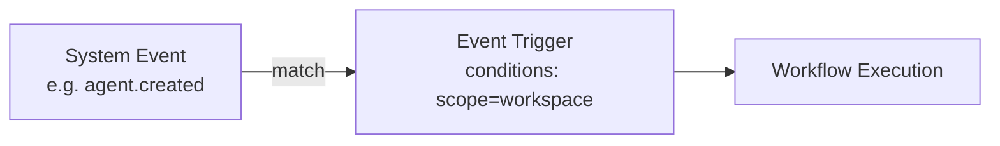
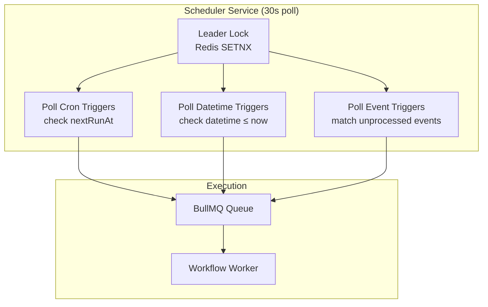

# Triggers

Triggers define **when** a workflow executes. Every workflow supports manual execution; triggers add automation.

## Trigger Types

### Repeatable Schedule (Cron)

Execute workflows on a recurring schedule using cron expressions:

```
0 9 * * 1-5    → 9:00 AM every weekday
*/30 * * * *   → Every 30 minutes
0 0 1 * *      → First day of every month at midnight
```

### Exact Datetime

Execute once at a precise date and time. The trigger automatically deactivates after firing.

### Webhook

Expose an HTTP endpoint that triggers the workflow when called:

```
POST /api/webhooks/incoming/:path
```

Webhooks support:
- HMAC-SHA256 signature verification
- 5-minute replay protection
- Event ID deduplication

### Event Trigger

React to system events with optional data matching:



**Available system events:**

| Event | Emitted When |
|---|---|
| `agent.created` | New agent is created |
| `agent.updated` | Agent configuration changes |
| `agent.deleted` | Agent is removed |
| `agent.status_changed` | Agent activated/paused |
| `workflow.created` | New workflow is created |
| `workflow.updated` | Workflow configuration changes |
| `workflow.deleted` | Workflow is removed |
| `workflow.execution_started` | Execution begins |
| `workflow.execution_completed` | Execution succeeds |
| `workflow.execution_failed` | Execution fails |
| `trigger.created` | New trigger is added |
| `trigger.deleted` | Trigger is removed |
| `variable.created` | New variable is created |
| `variable.updated` | Variable value changes |
| `variable.deleted` | Variable is removed |
| `mcp_server.created` | New MCP server configured |
| `mcp_server.updated` | MCP server config changes |
| `mcp_server.deleted` | MCP server removed |

**Event Data Conditions:**

Filter events by matching key-value pairs in the event data:

| Key | Example Value | Description |
|---|---|---|
| `agentId` | UUID | Match specific agent |
| `agentName` | `"MyAgent"` | Match agent by name |
| `scope` | `"workspace"` | Match scope level |

Example: Trigger only when a workspace-scoped agent is created:
- Event: `agent.created`
- Condition: `scope = workspace`

### Manual

All workflows can be executed manually from the UI with an optional user input message.

## Scheduler Architecture



The scheduler runs as a separate Kubernetes deployment with:
- **Redis leader lock** — prevents duplicate execution in multi-replica setups
- **30-second poll interval** — balances responsiveness with resource usage
- **Idempotent execution** — events are marked as processed after matching
