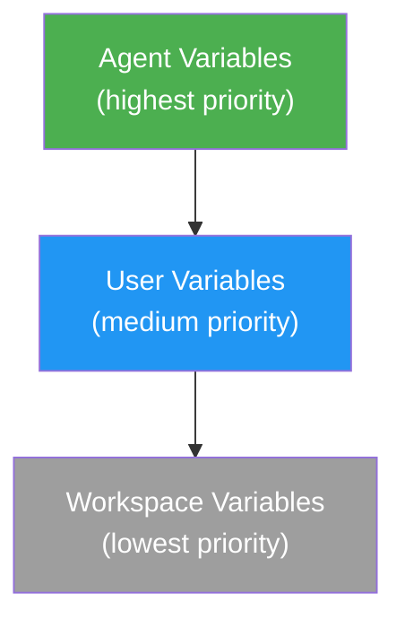

# Variables & Credentials

The platform provides a three-tier variable system for managing configuration and secrets.

## Variable Types

| Type | Description | Use Case |
|---|---|---|
| **Credential** | Encrypted at rest (AES-256-GCM) | API keys, tokens, passwords |
| **Property** | Encrypted at rest, injectable into prompts | Configuration values, settings |

## Scoping & Priority

Variables exist at three levels. When the same key exists at multiple levels, the most specific scope wins:



**Resolution order**: Agent → User → Workspace

### Example

If `API_KEY` is defined at all three levels:

| Scope | Value |
|---|---|
| Workspace | `ws-key-123` |
| User | `user-key-456` |
| Agent | `agent-key-789` |

**Resolved value**: `agent-key-789` (agent scope wins)

## Injection Methods

### Prompt Template Injection

Properties are injected into prompt templates using <code v-pre>{{ Properties.KEY }}</code> syntax:

```txt
Analyze the market for {⁣{ Properties.MARKET_SYMBOL }⁣}.
Current risk tolerance: {⁣{ Properties.RISK_LEVEL }⁣}
```

### Environment Variable Injection

Variables marked with `injectAsEnvVariable: true` are written to a `.env` file in the agent workspace:

```ini
API_KEY=resolved-value
DATABASE_URL=postgres://...
```

### Tool Access

Agents can read and modify variables using built-in tools:
- `read_variables` — List variables with optional type/scope filters
- `edit_variables` — Create or update variable values

## Key Format

Variable keys must match: `^[A-Z_][A-Z0-9_]*$` (UPPER_SNAKE_CASE)

Examples: `API_KEY`, `MARKET_SYMBOL`, `MAX_RISK_PERCENT`

## Credential Reference

When creating agents with private GitHub repos, you can reference a credential variable instead of entering a token directly. The credential is resolved at execution time, keeping the actual secret out of the agent configuration.
