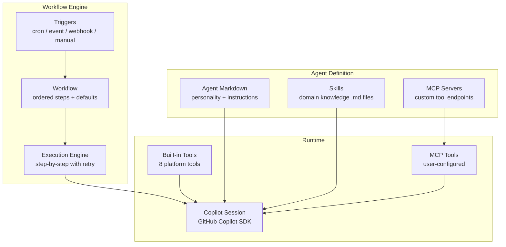

# What is Agent Orchestra?

**Agent Orchestration Platform** is an autonomous AI workflow engine powered by the [GitHub Copilot SDK](https://github.com/features/copilot). It lets you define AI agents as Git-hosted markdown files, connect them to multi-step workflows, and execute them on schedule, via webhooks, or triggered by system events.

## The Problem

Building production AI automation requires solving many infrastructure challenges beyond the AI model itself:

- **Scheduling**: Running AI tasks on cron schedules or in response to events
- **Orchestration**: Chaining multiple AI steps where each builds on the previous output
- **Credential management**: Securely storing and injecting API keys and secrets
- **Multi-tenancy**: Isolating agents, workflows, and data across teams
- **Auditability**: Tracking what each agent decided and why
- **Error recovery**: Retrying from the failed step, not restarting the entire workflow
- **Tool integration**: Giving agents access to APIs, databases, and external services

## The Solution

Agent Orchestra provides all of this as a single platform:

## Architecture at a Glance

| Component | Technology | Purpose |
|---|---|---|
| **Agent API** | Hono v4.6, Node.js | REST API for agents, workflows, triggers, executions |
| **Agent UI** | Nuxt 3, Vue 3, Tailwind | Dashboard for managing everything |
| **Database** | PostgreSQL 16 + pgvector | Persistent storage with vector embeddings |
| **Queue** | Redis 7 + BullMQ | Job queue for workflow execution |
| **Scheduler** | Custom Node.js service | Polls triggers every 30 seconds |
| **AI Engine** | GitHub Copilot SDK | Creates and manages Copilot sessions |
| **Deployment** | Docker + Helm + Kubernetes | Local Docker Desktop K8s |

## Who Is This For?

- **DevOps teams** automating recurring analysis and reporting
- **AI engineers** building multi-step agent pipelines
- **Platform teams** providing AI automation as a shared service
- **Developers** who want agent orchestration without building infrastructure

## Next Steps

- [Getting Started](/guide/getting-started) — Set up the platform locally
- [Core Concepts](/guide/agents) — Understand agents, workflows, and triggers
- [Architecture](/architecture/overview) — Deep dive into the system design
