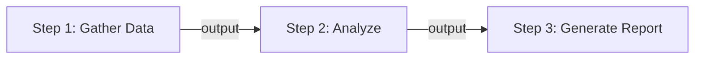
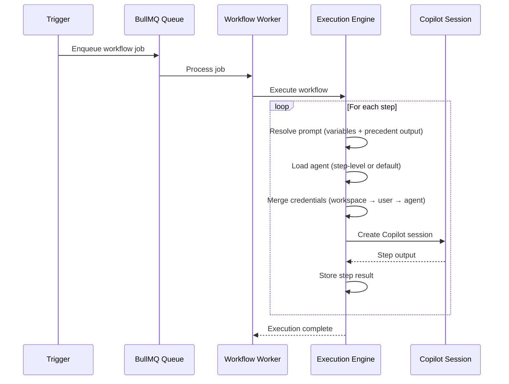

# Workflows & Steps

A **workflow** is an ordered sequence of steps, each executed as a separate Copilot session. Steps pass output forward, enabling complex multi-stage reasoning.

## Workflow Structure



Each workflow has:
- **Name & description**
- **Default agent** — used when a step doesn't specify its own
- **Default model** — selected from admin-configured models (e.g., `claude-sonnet-4-6`, `gpt-5.4`)
- **Default reasoning effort** — `high`, `medium`, or `low`
- **Scope** — `user` (private) or `workspace` (shared)

## Steps

Each step defines:

| Field | Description |
|---|---|
| **Name** | Human-readable step label |
| **Prompt Template** | The prompt sent to the Copilot session |
| **Agent** | Optional override (defaults to workflow's agent) |
| **Model** | Optional override (defaults to workflow's model) |
| **Reasoning Effort** | Optional override |
| **Timeout** | Max execution time in seconds (30–3600) |

### Precedent Output

Use `<PRECEDENT_OUTPUT>` in prompt templates to inject the previous step's output:

```
Based on the following analysis, decide what actions to take:

<PRECEDENT_OUTPUT>

Consider risk management and constraints.
```

### Variable Injection

Use <code v-pre>{{ Properties.KEY }}</code> syntax to inject property variables into prompts:

```txt
Analyze the market for {⁣{ Properties.MARKET_SYMBOL }⁣}.
Current risk limit: {⁣{ Properties.MAX_RISK_PERCENT }⁣}
```

## Execution Flow



## Retry Mechanism

When a step fails, you can retry the execution **from the failed step**:
- All completed steps are preserved
- The failed step is re-executed with fresh context
- Subsequent steps continue normally

## Model Selection

Models are managed by workspace admins in **Admin → Models**. The platform comes with 4 default models:

- `claude-sonnet-4-6` (Anthropic)
- `claude-opus-4-6` (Anthropic)
- `gpt-5.4` (OpenAI)
- `gpt-5-mini` (OpenAI)

Models appear as dropdown options in workflow and step configuration.
